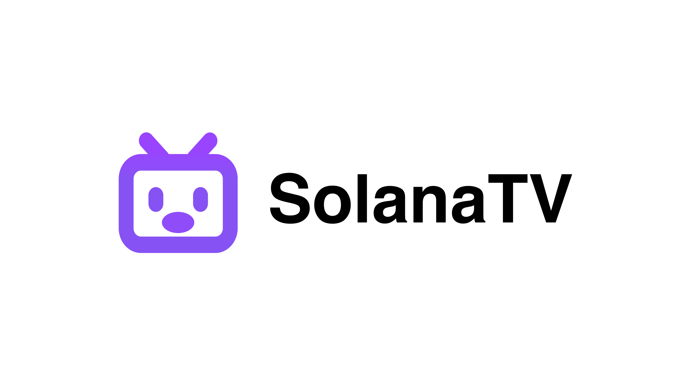
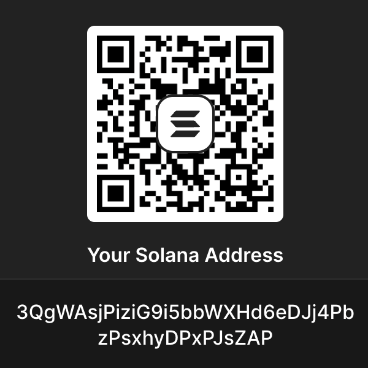

# SolanaTV



Enjoy effortless TV viewing with SolanaTV Web3 IPTV Player

## Usage Instructions

* Press the **left button** on the remote control / **single tap** on the touch screen to open the program list.
* Press the **right button** on the remote control / **double tap** on the touch screen to open the settings.
* Press the **back button** on the remote control to close the program list or settings.
* After opening the settings page, select **Remote Configuration** and scan the QR code to configure video sources and other settings.
* If the video source is already configured, and the "Auto-update video source on startup" option is enabled, the software will automatically update the video source upon startup.
* When the program list is displayed, use the **right button** to **favorite/unfavorite** a program.

Note:

* The video source can be set to a local file, formatted as: file:///mnt/sdcard/tmp/channels.m3u
  /channels.m3u

Currently supported configuration formats:

* txt
    ```
    Group Name, #genre#
    Title, Video URL
    ```
* m3u
    ```
    #EXTM3U
    #EXTINF:-1 tvg-name="Standard Title" tvg-logo="Icon" group-title="Group Name", Title
    Video URL
    ```
* json
    ```json
    [
      {
        "group": "Group Name",
        "logo": "Icon",
        "name": "Standard Title",
        "title": "Title",
        "uris": [
          "Video URL"
        ],
        "headers": {
          "user-agent": ""
        }
      }
    ]
    
    ```

## Others

It is recommended to install via ADB:

```shell
adb install my-tv-0.apk
```

## TODO

* Support for Solana login
* Video decoding
* Support for playback
* Detailed EPG
* Light-colored menu
* Invalid channel?
* Determine if the file has been modified
* Multi-source management
* What if the last played channel is not in favorites?
* Display group when the list is empty
* Default channel menu display

## Donations

Solana ❤️: 3QgWAsjPiziG9i5bbWXHd6eDJj4PbzPsxhyDPxPJsZAP

